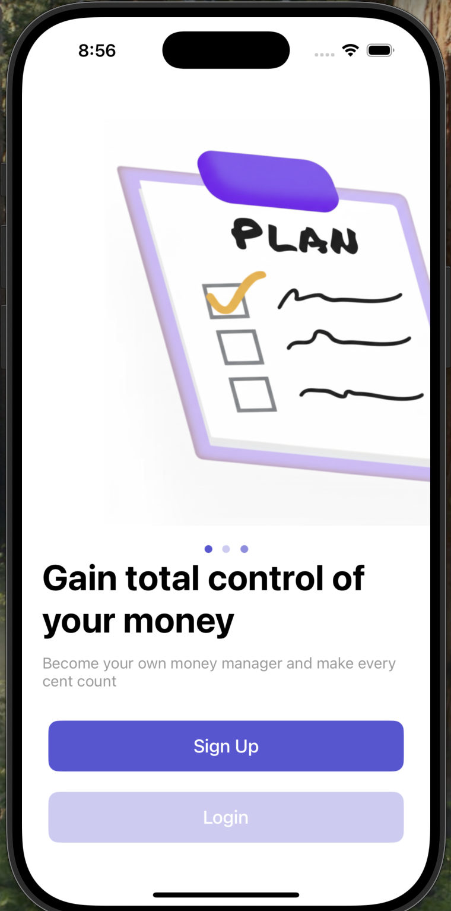

# WalletriX
A simple and intuitive iOS Expense Tracker app built using UIKit. This app allows users to track daily spending, categorize expenses, and visualize financial habits over time. Whether you're budgeting for the month or reviewing past transactions, this app makes money management easy and efficient.

## 📱 Preview

  
  

